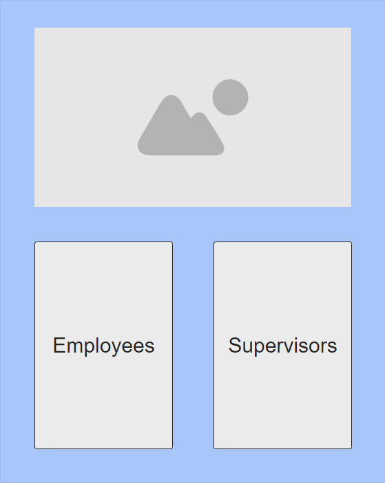

# TimeKeeper 

### Design Document

## Introduction  

Timekeeper is a time keeping application designed for companies to track employee hours and payroll. Allows both the employer and employees to track and view previous payroll.

## Storyboard / Screen Mockups  

| Start Screen |  |
| --- | --- |
| Employee Login |  |
| Employee Main |  |
| Employee Current Period |  |
| Employee Payroll |  |
| Supervisor Login |  |
| Supervisor Payroll |  |
| Supervisor Edit Payroll |  |

## Functional Requirements

*As an* Employee  
*I want* to enter my hours for each pay period  
*So that I can* easily submit my time to payroll.  
* **Given** I am on the payroll page
* **When** I enter all required fields properly and click submit
* **Then** my hours for the pay period are submitted and stored in a database   

- **Given** I am on the payroll page
- **When** I try to submit the payroll form and required fields are missing
- **Then** I receive an error message letting me know I forgot a required field.  

*As an* Employee  
*I want* to view old payroll sheet  
*So that I can* verify my pay.  
* **Given** I am logged in
* **When** I click the see payroll history button
* **Then** each of my payroll records are displayed in a table.  

*As a* Supervisor  
*I want* to view all payroll records for a specified period of time  
*So that I can* review payroll  
* **Given** I am logged in as Supervisor
* **When** I click view all records
* **Then** a table of all employee payroll records are displayed.   

- **Given** I am logged in as admin
- **When** I search for a particular employee&#39;s payroll either by name or employee id
- **Then** a table of only that employee&#39;s payroll records are displayed.   

*As a* Supervisor  
*I want* to log in to Supervisor view  
*So that I can* view all employee payroll  
* **Given** I am on login screen
* **When** I enter my Supervisor username and password correctly
* **Then** I am taken to the Supervisor view where I can view payroll.  

## Class Diagram

## JSON Schema

## Scrum Roles

Project Manager | Business Logic | UI 
-------------------- | ------------ | ------------------ 
Justin Roseman | Juan O. Lopez Rosado | Minh-Dao Vu

## Github Project Link

[https://github.com/JayBit33/TimeKeeper](https://github.com/JayBit33/TimeKeeper)

## Weekly Stand-up Meeting 

Every Tuesday at 6PM 

[Using Microsoft Teams Meeting](https://teams.microsoft.com/l/meetup-join/19%3ameeting_ZTZmNDg3Y2MtN2VkZi00NzU3LWI0MTktM2EzZmQ4MDQyZWY2%40thread.v2/0?context=%7b%22Tid%22%3a%22f5222e6c-5fc6-48eb-8f03-73db18203b63%22%2c%22Oid%22%3a%22658973be-03e2-4222-9e7d-ab33bc59a71a%22%7d)
